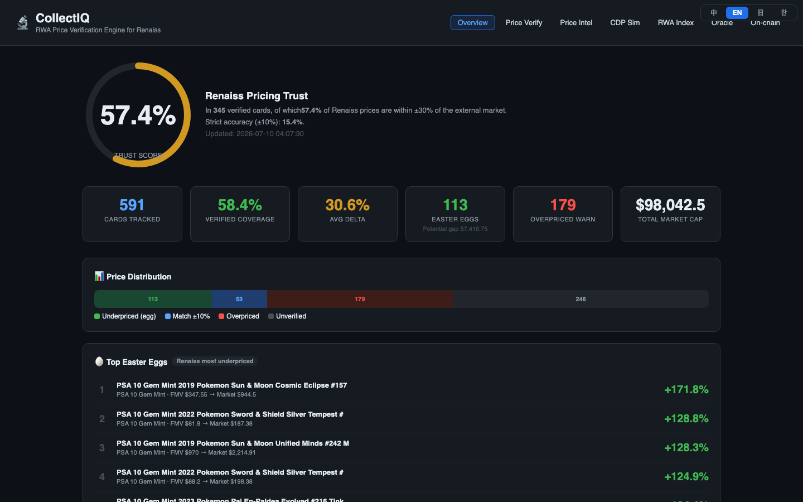
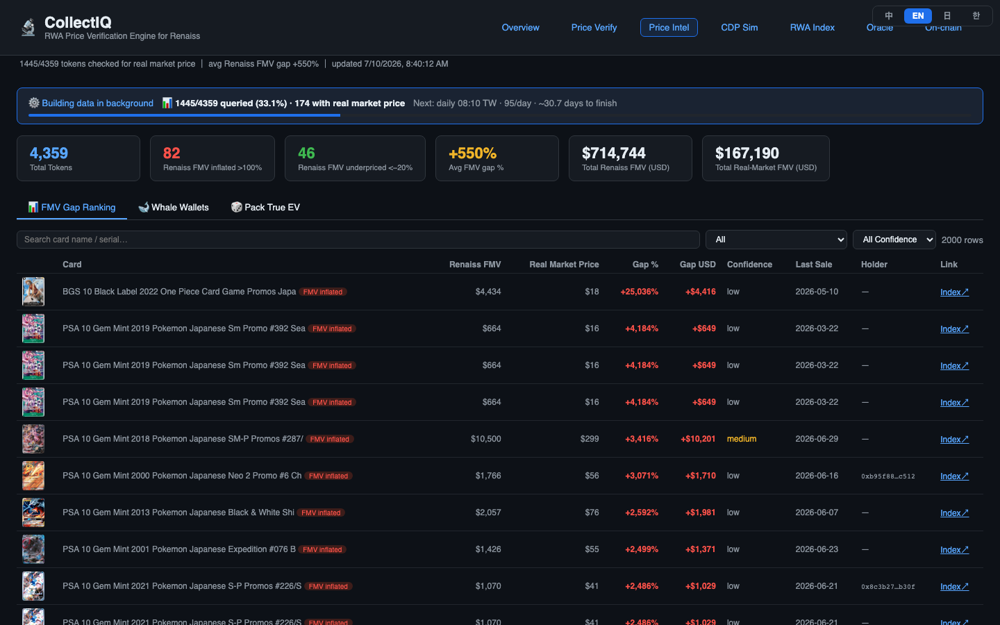
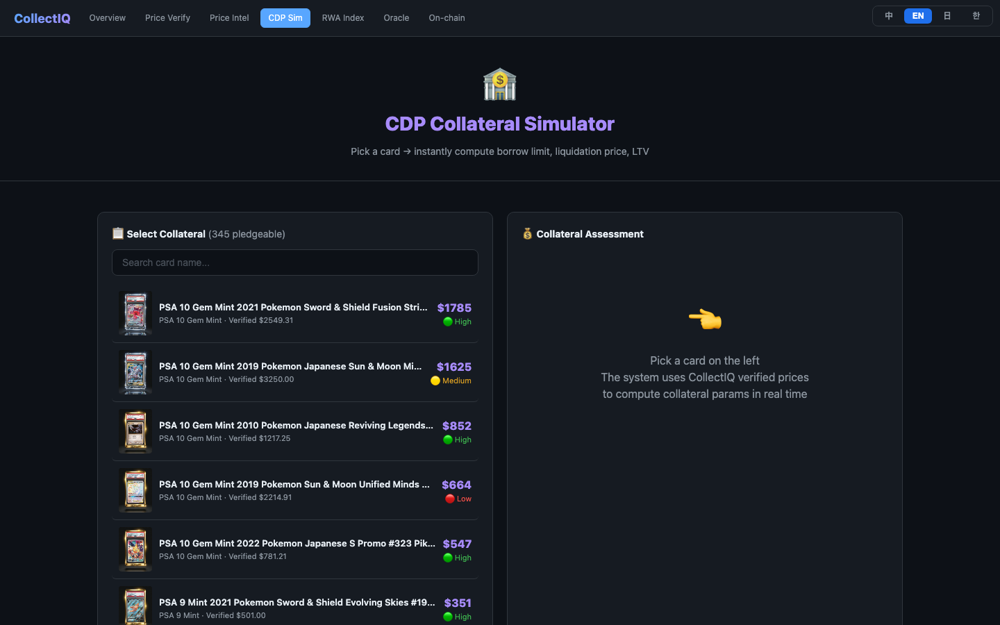
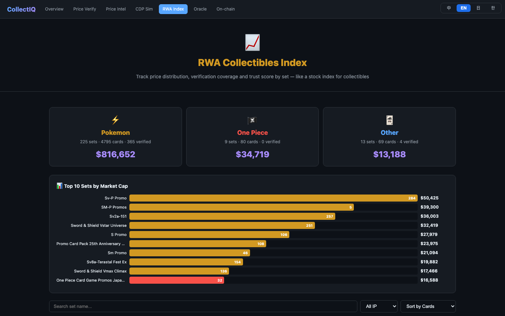
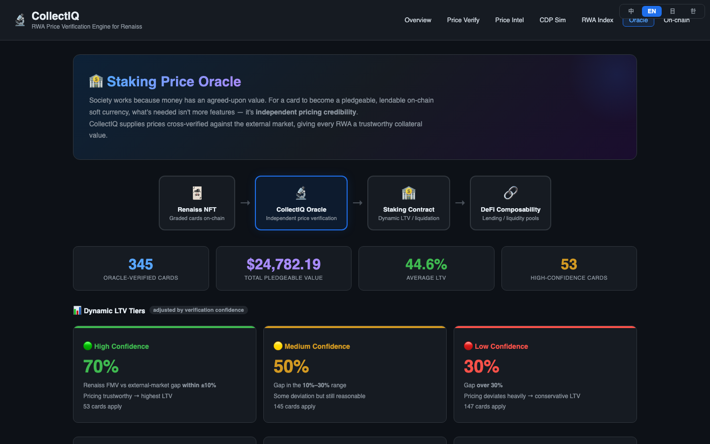
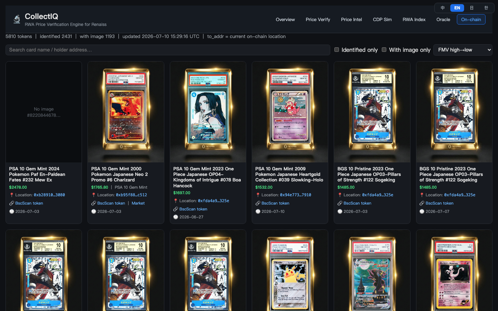
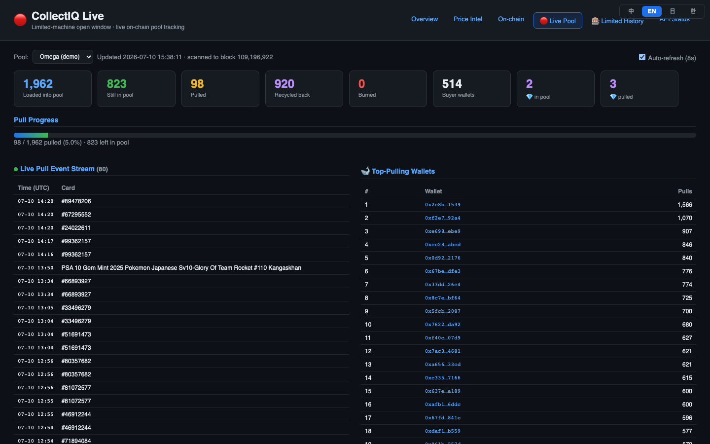
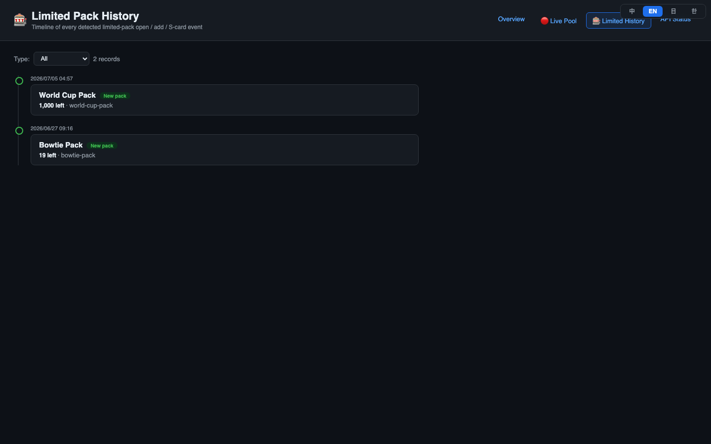
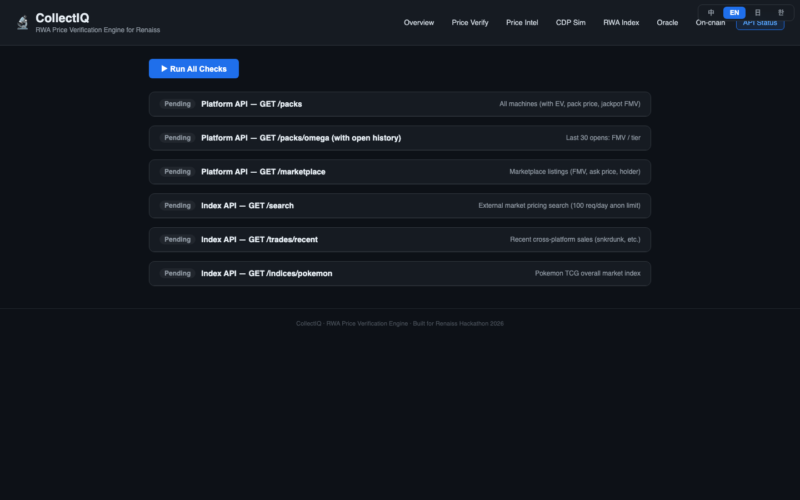

# Renaiss EV Monitor v2 (CollectIQ)

競品定價情報 / 藏寶卡（hidden-gem）獵手，鎖定 **Renaiss** 平台——BSC 鏈上的
Pokémon / One-Piece 分級卡 gacha（抽卡機）。系統結合官方 API、獨立第三方成交價、
與 BSC 鏈上事件，計算每台卡機的期望值（EV）、追蹤即時獎池、並揪出「Renaiss 標低、
市場標高」的低估卡。

> 這是資料分析 / 監控工具，**不涉及下單、轉帳或任何鏈上交易**。所有引用的合約
> 地址皆為公開的 Renaiss 卡池合約，可於 BscScan 查證。

## 畫面 Screenshots

介面支援四語切換（預設英文 · 中 · 日 · 한），右上角切換。

| Price Verification (home) | Price Intel | CDP Collateral Sim |
|---|---|---|
|  |  |  |

| RWA Index | Oracle | On-chain Holdings |
|---|---|---|
|  |  |  |

| Live Pool | Limited History | API Status |
|---|---|---|
|  |  |  |

更多截圖見 [`docs/screenshots/`](docs/screenshots/)。

## 功能

- **EV 計算** — 每台卡機的官方 EV vs 實際開包 FMV 均值，算出值回票價倍率與偏差。
- **鏈上即時追蹤** — 掃 BSC Transfer log，追每張卡被抽出 / 回收 / 銷毀，延遲可壓到分鐘級。
- **即時獎池面板**（`/live`）— 限量卡機開放窗口內，動態反推剩餘池價值與抽卡進度。
- **獨立價驗證** — 以 PriceCharting（彙整 eBay 成交）交叉比對 Renaiss 自家指數，
  明確標示來源獨立性，不混用。
- **市場掛單比對** — 找出 Renaiss 掛單價明顯低於市場行情的 easter egg。
- **限量卡機歷史**（`/limited-history`）— 每次限量場的開放 / 新增 / S 卡事件時間軸。
- **資料新鮮度徽章 + 存活探針** — `/api/freshness` 標示各來源是否過期；`/healthz`
  搭配 watchdog，服務停擺時發 Telegram 告警。

## 架構

```
瀏覽器 → (可選)反向代理 → dashboard.py (Flask, DASHBOARD_PORT)
                              │
        ┌─────────────────────┼──────────────────────────┐
        ▼                     ▼                          ▼
  api.renaiss.xyz/v0    api.renaissos.com/v1        BSC 鏈上 (BNB_RPC)
  卡機 / 市場 / 持有     卡片指數 / 定價 / 成交       Transfer log 抽卡事件
```

- `renaiss_api.py` — 兩個後端 API 的統一封裝層（含快取、429/5xx 指數退避）。
- `dashboard.py` — Flask 網頁 + JSON API（EV、鏈上、市場、獨立價、新鮮度）。
- `scripts/` — 一組排程任務（鏈上掃描、卡機目錄補抓、比價、限量偵測、存活探針…）。
- 資料存 SQLite：`data/collectiq_core.db`（卡表 / 持有 / 帳本）、
  `data/onchain_pulls.db`（鏈上抽卡 + 同步狀態）。

### ⚠️ 已知資料坑
- `expectedValueInUsd` / `featuredCardFmvInUsd` / `recentOpenedPacks[].fmv` 欄名雖寫
  `InUsd`，**實測為美分**，讀取時需 `/100`。
- 價格來源分兩類且**不可混用**：`renaiss_index`（Renaiss 自家指數，非獨立）
  vs `pricecharting_ebay`（獨立、可查證）。只有獨立來源有可點的查證連結。

## 安裝與執行

```bash
pip install -r requirements.txt

# 設定環境變數（Telegram 告警、帶 key 的 BSC RPC 等）
cp .env.example .env
#   TELEGRAM_BOT_TOKEN / TELEGRAM_CHAT_ID — 告警用（不填則只印 log）
#   BNB_RPC="<逗號分隔的帶 key 節點>"      — 鏈上同步用（不填退化成公共節點）

# 啟動 Web Dashboard
python dashboard.py          # 埠由 DASHBOARD_PORT 決定
```

macOS 下各背景任務以 launchd 排程，範例 plist 見 `deploy/launchagents/`
（`BNB_RPC` 已脫敏，還原時需填回，詳見該目錄 README）。

## 主要 API 端點

| 端點 | 說明 |
|------|------|
| `/healthz` | 存活探針（Flask + DB 可用性） |
| `/api/freshness` | 各資料來源新鮮度 / 是否過期 |
| `/api/new-pack` | 目前開放中 / 最近的限量卡機 |
| `/api/limited-history` | 限量卡機事件時間軸 |
| `/api/pack-ev` | 卡機 EV 分析 |
| `/api/live/*` | 即時獎池 / 抽卡事件 / EV 反推 |
| `/api/comparison` | Renaiss vs 獨立價交叉比對 |

## 常用指令

```bash
python renaiss_api.py                              # API 封裝快速自測
python scripts/grab_pack_contents.py --daily       # 卡機目錄 + 獨立/指數補價
BNB_RPC="<keyed nodes>" python scripts/track_pulls_onchain.py   # 手動跑鏈上追蹤
```

## License

MIT
